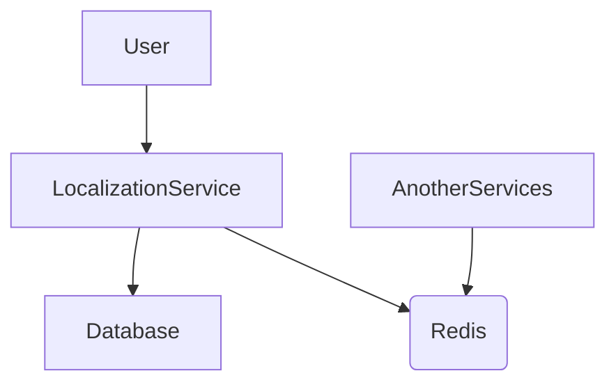

### Localization Preview Api Service
#### Contains
* Asp.net core 6.0 web api version app
* Translations Api - Create, Update, GetByEntity, GetById, Search methods
* Postgres data store, Redis like cache. 

### You need up redis and postgres for local development.
### You can use:

### Docker commands

- `docker run --name loc_redis_preview -d -p 6379:6379 redis`
- `docker run -p 5435:5435 -e POSTGRES_PASSWORD="loc" -e POSTGRES_USER="loc" -e POSTGRES_DB="localizations" --name loc_preview postgres:13`

### Or 

### Docker compose

`docker-compose up --build -d` from ./ directory

### p.s. don't forget add tables ./backend/V1.0_init.sql if you use docker's commands

### Swagger UI
* http://localhost:5047/localization-api/swagger/index.html

Graph flow:

